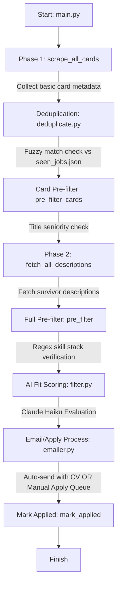

#  Multi-Platform Job Automator

A thorough and comprehensive review of the automated job scraping, scoring, and application pipeline tailored for a final year IIT student's profile.

---

## 🏗️ Architectural Overview & System Flow

The codebase is an elegant, end-to-end automated job search and application pipeline. It is structured into separate modular scripts that handle distinct phases of the job application lifecycle.



### Key Modules & Components

1. **`main.py`**: The central orchestrator. It manages execution options (`--dry-run` vs `--send-pending`), defines the list of search configurations, and handles the flow control from card retrieval to email sending.
2. **`scrapers/`**: High-performance scraper suite:
   - `__init__.py`: Coordinates browser instances using Playwright. Reuses single browser contexts per platform to avoid memory bloating.
   - `linkedin.py`: Playwright-driven scraper that scrolls the LinkedIn Jobs feed to extract card data, and then fetches job details sequentially.
   - `naukri.py`: Custom-tailored Playwright scraper for Naukri.com using multiple fallback selectors and robust user-agent headers to evade detection.
   - `remoteok.py`: Fast API-based scraper leveraging RemoteOK's public JSON API.
3. **`deduplicator.py`**: Avoids duplicate actions. It builds robust, normalized alphanumeric fingerprints (using Title + Company + Location + Link slug) and stores them in `seen_jobs.json` to prevent re-processing.
4. **`pre_filter.py`**: A cost-efficient static matching layer. It drops obviously senior or irrelevant roles (e.g. checks for "senior", "lead", "5+ years") and matches skills against candidate keywords *before* invoking the LLM.
5. **`filter.py`**: Leverages Claude (`claude-haiku-4-5-20251001`) to score the fit of candidate profiles against job descriptions. Results are cached in `score_cache.json` with a 7-day expiration timer.
6. **`candidate_profile.py`**: Single source of truth containing contact info and the structured CV text (`MY_CV`) for Ashvin Patidar (IIT Kanpur).
7. **`emailer.py`**: Creates hyper-personalized, non-corporate application emails via Claude. It resolves HR emails via description regex, a local cache, or Hunter.io API. Saves drafts to `pending_jobs.json` in dry-run mode, auto-sends SMTP emails with PDF CV attachments, and manages fallback listings in `manual_apply.json`.

---

## 📈 Detailed Pros & Cons

### ✅ Pros (Strengths)

* **Cost & Token Optimization (Multi-Tier Filtering)**: Excellent cost management. The application pre-filters out inappropriate jobs using local, free keyword rules (seniority, experience requirements, basic stack match) before sending the text to Anthropic.
* **Smart Performance with Two-Phase Scraping**: Splits scraping into **Phase 1 (fast card list)** and **Phase 2 (full descriptions only for survivors)**. This speeds up scanning dramatically and avoids downloading descriptions for jobs that will instantly get filtered out anyway.
* **Flexible Email Resolution Model**: Employs a three-step email finder:
  1. Extracting emails directly from the job description (fast, free).
  2. Searching local email cache.
  3. Querying **Hunter.io API** with strict daily limits and a suitability threshold (`fit_score >= 70`).
* **Double Caching System**: Avoids duplicate computation. Both suitability scores and resolved emails are cached locally in JSON formats with age expiration.
* **Drafting and Manual Safety Mechanisms**:
  - `--dry-run` flag compiles emails in a `pending_jobs.json` file.
  - `--send-pending` flag sends them immediately without re-scraping.
  - `manual_apply.json` aggregates highly compatible jobs that do not list a direct email address, allowing manual web applications.
* **Evading Simple Blocks**: Playwright scrapers use custom, modern user-agents, random delays (2-3s), and smart waits on specific DOM elements to minimize the risk of IP throttling.

---

### ❌ Cons (Weaknesses & Vulnerabilities)

* **DOM Selector Fragility**: Playwright scrapers use hardcoded class selectors (e.g. `.job-search-card` on LinkedIn and `article.jobTuple` on Naukri). These job platforms constantly change their layouts, which can break the scrapers without warning.
* **Blocking/Sync Calls inside Async Event Loop**: In `filter.py` and `emailer.py`, synchronous operations like `time.sleep(1)` are used inside loops. In Python's `asyncio` environment, standard synchronous sleeps block the whole execution thread instead of letting other tasks run concurrently.
* **Sync Issues between CV Text and PDF**: The CV text is hardcoded inside `candidate_profile.py` as a Python string `MY_CV`, while the attachment is `Ashvin_Patidar_CV.pdf`. If you update your PDF CV, you must remember to manually update the text string in the code, which is highly prone to discrepancies.
* **Simple Email Authentication (SMTP SSL)**: The mailer relies on Gmail App Passwords. Although fine for personal utilities, bulk cold mailing via standard Gmail servers can lead to spam folder routing or account suspension.
* **Sequential Description Fetching**: Fetching descriptions is done strictly one-by-one. Scraping 30 survivor descriptions with a 2-3s pause takes upwards of 1.5 minutes.
* **Hardcoded Search and Filter Configurations**: Changing keywords, locations, or filter parameters (e.g., adding an experience keyword or custom stack exclusions) requires modifying code in `main.py` and `pre_filter.py`.

---

## 🎯 Conclusions & Recommendations

This codebase is a **highly sophisticated, cost-conscious, and production-grade personal automation script**. It beautifully integrates modern LLMs (Claude) with classic web scraping techniques to create a personalized, highly efficient job hunting agent.

To turn this prototype into an exceptionally robust application, we recommend implementing the following high-impact changes:

### 1. Dynamic PDF CV Extraction
Eliminate the manual text sync issue by reading the text directly from the PDF on startup.
```python
# In candidate_profile.py
import pypdf

def extract_cv_text(pdf_path):
    reader = pypdf.PdfReader(pdf_path)
    return "\n".join(page.extract_text() for page in reader.pages)

MY_CV = extract_cv_text(CV_PATH)
```

### 2. External Configuration File
Separate logic from configuration by moving `SEARCH_CONFIGS` and filtering thresholds into a central `config.yaml` or `config.json`. This makes running scans under different parameters incredibly easy.

### 3. Evading Anti-Bot Mechanisms
Add advanced stealth mechanisms to the browser to ensure the scrapers don't get blocked during longer runs:
- Integrate `playwright-stealth` package to hide browser fingerprints.
- Use a proxy rotation pool for LinkedIn and Naukri queries.

### 4. Database Storage Refactoring
Migrate `seen_jobs`, `score_cache`, and `email_cache` from scattered, flat JSON files into a lightweight **SQLite** database. This improves indexing speed, ensures transaction safety, and prevents database corruption as your job history grows.

### 5. Async-Compliant Delays
Replace blocking sleep calls with non-blocking async calls:
```diff
- time.sleep(1)
+ await asyncio.sleep(1)
```
