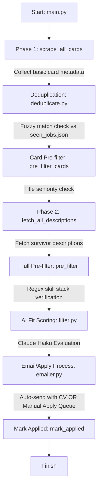

#  Multi-Platform Job Automator

A thorough and comprehensive review of the automated job scraping, scoring, and application pipeline tailored for a final year IIT student's profile.

---

## 🏗️ Architectural Overview & System Flow

The codebase is an elegant, end-to-end automated job search and application pipeline. It is structured into separate modular scripts that handle distinct phases of the job application lifecycle.



### Key Modules & Components

1. **`main.py`**: The central orchestrator. It manages execution options (`--dry-run` vs `--send-pending`), defines the list of search configurations, and handles the flow control from card retrieval to email sending.
2. **`scrapers/`**: High-performance scraper suite:
   - `__init__.py`: Coordinates browser instances using Playwright. Reuses single browser contexts per platform to avoid memory bloating.
   - `linkedin.py`: Playwright-driven scraper that scrolls the LinkedIn Jobs feed to extract card data, and then fetches job details sequentially.
   - `naukri.py`: Custom-tailored Playwright scraper for Naukri.com using multiple fallback selectors and robust user-agent headers to evade detection.
   - `remoteok.py`: Fast API-based scraper leveraging RemoteOK's public JSON API.
3. **`deduplicator.py`**: Avoids duplicate actions. It builds robust, normalized alphanumeric fingerprints (using Title + Company + Location + Link slug) and stores them in `seen_jobs.json` to prevent re-processing.
4. **`pre_filter.py`**: A cost-efficient static matching layer. It drops obviously senior or irrelevant roles (e.g. checks for "senior", "lead", "5+ years") and matches skills against candidate keywords *before* invoking the LLM.
5. **`filter.py`**: Leverages Claude (`claude-haiku-4-5-20251001`) to score the fit of candidate profiles against job descriptions. Results are cached in `score_cache.json` with a 7-day expiration timer.
6. **`candidate_profile.py`**: Single source of truth containing contact info and the structured CV text (`MY_CV`) for Ashvin Patidar (IIT Kanpur).
7. **`emailer.py`**: Creates hyper-personalized, non-corporate application emails via Claude. It resolves HR emails via description regex, a local cache, or Hunter.io API. Saves drafts to `pending_jobs.json` in dry-run mode, auto-sends SMTP emails with PDF CV attachments, and manages fallback listings in `manual_apply.json`.

---
+ await asyncio.sleep(1)
```
